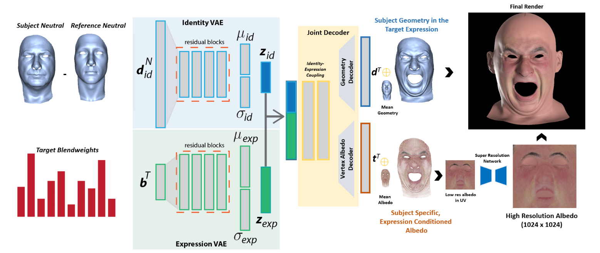

# Semantic Deep Face Models


This repository implements the paper [Semantic Deep Face Models](https://studios.disneyresearch.com/2020/11/25/semantic-deep-face-models/) by Prashanth Chandran et al. The albedo generation is omitted. The system uses the [Facewarehouse dataset](http://kunzhou.net/zjugaps/facewarehouse/) to train the VAE. The goal of the system is to build an autoencoder that generates new faces. It disentangles identity and expression by design and provides  two latent spaces (Z<sub>id</sub> and Z<sub>exp</sub>) that can be tweaked separately to modify expression or identity. The system uses fully connected layers in the encoder and decoder with residual connections that span across the entire achitecture. One improvement would be to represent the meshes with graph convolutions instead.

## Folder structure of dataset: <br>
```
root/
    Tester_1/
        Blendshape/
            shape1.obj
            shape2.obj
            ...
        Blendshape/
            shape1.obj
            shape2.obj
            ...
        ...
    Tester_2/
        Blendshape/
            shape1.obj
            shape2.obj
            ...
        Blendshape/
            shape1.obj
            shape2.obj
            ...
        ...
    ...
```

## Installation
Create a new conda environment (optional):
```
conda env create -n <env_name> python=3.10
conda activate <env_name>
```

Install dependencies:
```
pip install -r requirements.txt
```

If you are on Windows, you can install CUDA for faster training:
```
pip3 install torch torchvision torchaudio --index-url https://download.pytorch.org/whl/cu118
```

## Run
Train model: ```python train.py``` <br>
Random faces: ```python sample.py``` <br>
Interpolation: ```python interpolate.py``` <br>

## Requirements
- Python 3.10.x
- torch
- numpy
- trimesh
- pyglet
- scipy
- matplotlib
- opengl
- pyqt6